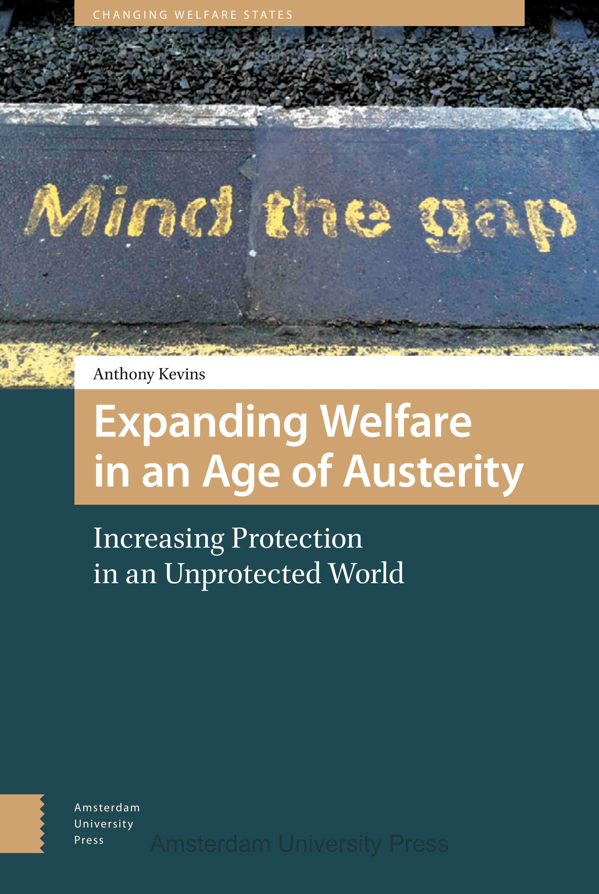

Cette section offre une présentation de mes projets de recherche actuels et passés. Vous pouvez également télécharger toutes mes publications [ici](https://anthonykevins.github.io/fr/publications/) (libre accès) ou consulter mon [CV](https://anthonykevins.github.io/files/CV_fr.pdf).

### Qui devrait avoir un mot à dire ? Préférences pour la représentation différentielle

La représentation équitable est le fondement de la démocratie représentative. Cela dit, les citoyens y sont-ils réellement favorables ? Comme on peut le constater en observant les débats houleux sur l’influence de certains groupes sociaux, les gens peuvent avoir des positions très diverses sur la représentation différentielle (c’est-à-dire l’influence inégale des citoyens sur le processus politique). Une personne peut croire, par exemple, qu’en matière de politiques d’intégration, les immigrés récents méritent d’avoir une influence accrue (à cause de leur degré d’affectation), une influence diminuée (à cause de leurs intérêts particuliers), ou une influence égale à celle des autres. De surcroît, le même citoyen pourrait simultanément avoir des préférences très diverses quant à d’autres groupes sociaux ou domaines politiques (par exemple, au sujet des banquiers et de la législation financière, ou des retraités et des services aux aînés). Financé par l'Union européenne par le biais d'une bourse Marie Skłodowska-Curie (« Individual Fellowship »), ce projet explore donc les attitudes envers l’influence de groupes spécifiques sur les enjeux qui les préoccupent.

Mes publications se portent sur :

-   [Les reformes policières et la communauté noire](https://onlinelibrary.wiley.com/doi/epdf/10.1111/pops.12688) 
-   [Les reformes fiscales et la classe aisée](https://journals.sagepub.com/doi/pdf/10.1177/0032321720956327)
-   [L'impact des consultations sur la perception de responsabilité](https://doi.org/10.1007/s11109-021-09751-5)

Pour consulter d'autres études liées à ce projet, veuillez me contacter par [courriel](mailto:a.kevins@lboro.ac.uk).

### L'universalisme et l'État-providence

À quel point les citoyens sont-ils attachés à l’universalisme, la redistribution et l’État-providence ? Quels sont les facteurs qui influencent cet attachement ? Par mon affiliation au projet UNIWEL (« Universalism and the Welfare State » ) à l’Université d’Aarhus, je me suis penché sur divers sujets liés à ce thème, incluant :

-   [Les motivations imputées aux personnes qui sont pour ou contre la redistribution](https://www.cambridge.org/core/services/aop-cambridge-core/content/view/D2DC2B5761B7474254AB8BEC75CF9B0D/S0047279419000175a.pdf/motive_attribution_and_the_moral_politics_of_the_welfare_state.pdf)
-   [Le rapport entre l'universalisme et l'intégration des immigrants](https://repository.lboro.ac.uk/articles/journal_contribution/The_effects_of_welfare_state_universalism_on_migrant_integration/9976226)
-   [Les conséquences de l'identité de classe sur les préférences politiques](https://repository.lboro.ac.uk/articles/journal_contribution/The_illusion_of_class_in_welfare_state_politics_/9976223)
-   [L'effet de la structure d'inégalité sur les préférences de redistribution à travers l'échelle de revenus](https://repository.lboro.ac.uk/articles/journal_contribution/Yardsticks_of_inequality_Preferences_for_redistribution_in_advanced_democracies/9976232)
-   [Le contenu des programmes de partis sur l'égalité et l'État-providence](https://repository.lboro.ac.uk/articles/journal_contribution/Peeping_at_the_corpus_What_is_really_going_on_behind_the_equality_and_welfare_items_of_the_Manifesto_project_/9976253)

Une partie de cette recherche est basée sur un sondage inédit, effectué aux États-Unis et dans neuf pays d’Europe occidentale. Cette enquête unique examine les préférences en matière de politique sociale selon différentes perspectives, notamment les préférences liées à la perception d’équité, d’immigration et de compromis sur la politique fiscale.

### Les inclus et les exclus de l'État-providence

Qui mérite notre appui collectif ? Les réponses possibles à cette question ont varié radicalement à travers le temps, les pays et les domaines politiques. Alors que d'un côté, plusieurs systèmes de protection sociale se sont caractérisés par des lacunes dans leur couverture, la façon par laquelle les gouvernements ont étendu l'accès aux allocations varie grandement. D'un autre côté, ce processus a été contrebalancé par des efforts pour restreindre l'accès, afin de décourager la dépendance et de limiter les dépenses sociales.

Mes publications sur ce sujet se focalisent sur :

-   [Les facteurs qui façonnent les réformes de l’aide sociale](https://repository.lboro.ac.uk/articles/journal_contribution/Political_actors_public_opinion_and_the_extension_of_welfare_coverage/9976259)
-   [La précarité sur le marché du travail et l'opinion publique à l'égard de l'immigration](https://repository.lboro.ac.uk/articles/journal_contribution/Immigrant_sentiment_and_labour_market_vulnerability_economic_perceptions_of_immigration_in_dualized_labour_markets/9976301) et [les politiques concernant les demandeurs d'asile](https://anthonykevins.github.io/files/Asylum_Seekers.pdf)
-   [La confiance généralisée des inclus et des exclus](https://repository.lboro.ac.uk/articles/journal_contribution/Dualized_trust_risk_social_trust_and_the_welfare_state/9976265) 
-   [La problématisation et la résolution des lacunes dans la couverture sociale (livre - version libre accès)](https://repository.lboro.ac.uk/articles/book/Expanding_welfare_in_an_age_of_austerity_Increasing_protection_in_an_unprotected_world/9994709)
  

Globalement, mon livre (également disponible sur [JSTOR](https://www.jstor.org/stable/j.ctt20krz5m), [Amazon](https://smile.amazon.com/Expanding-Welfare-Age-Austerity-Unprotected/dp/9462980217) et le [site web de la maison d'édition](https://www.aup.nl/en/book/9789462980211/expanding-welfare-in-an-age-of-austerity)) approfondit le dilemme auquel les partis et syndicats de gauche sont confrontés par rapport aux lacunes des couvertures sociales en période d’austérité : doivent-ils choisir de protéger les acquis aux inclus ou plutôt d’étendre la couverture sociale aux exclus ? L’ouvrage comprend deux ensembles de comparaison entre la France et l’Italie (soutenus par plus d’une demi-année de recherche sur le terrain) et utilise une méthodologie quantitative et qualitative afin de tester la généralisabilité des résultats. Je constate que des facteurs-clés, normalement associés avec l’Europe du Sud, ont influencé les positions des partis et, par conséquent, des politiques, à la fois de façon directe (par la création d’avantages organisationnels) qu’indirecte (par le conditionnement de l’opinion publique). Dans l’ensemble, le livre fait avancer les débats sur le rapport entre l’accès à la sécurité sociale et les préférences en matière de politiques sociales, tout en offrant un aperçu des défis réels auxquels sont confrontées les politiques actuelles dans le cadre des programmes d’austérité.
