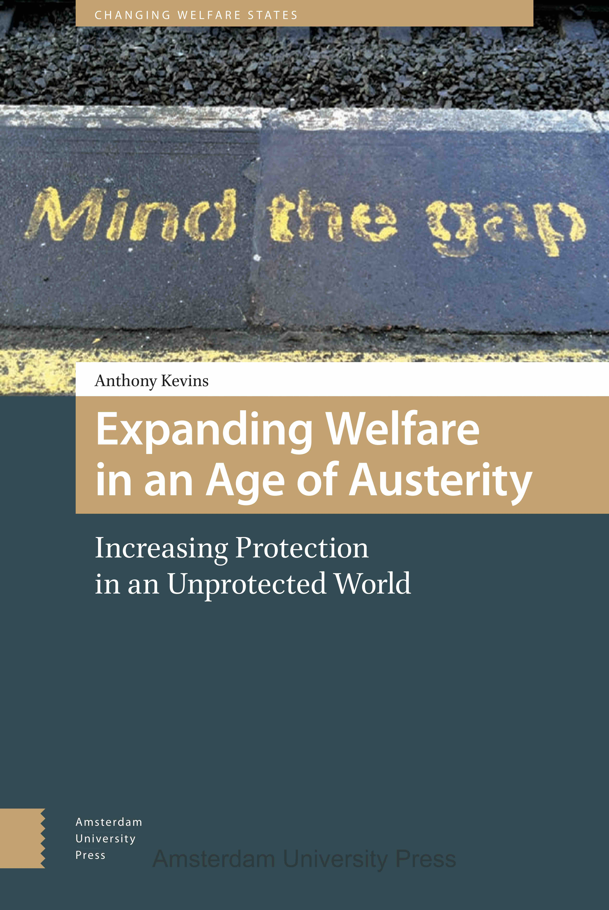

Below you will find an overview of my ongoing and past research projects, as well as a sample of my publications on each theme. A complete list of my published research can be found [here](https://anthonykevins.github.io/publications/) (including links to open-access copies of my articles) or via my [CV](https://anthonykevins.github.io/files/CV.pdf).

### Who Should Have a Say? Preferences for Differentiated Representation

Equal representation is at the core of representative democracy, but are citizens actually in favour of it? As heated debates about the influence of certain groups make clear, people may take a variety of stances toward differentiated representation (i.e. differential group influence over policy). Citizens may believe, for example, that when it comes to designing integration policies, recent immigrants deserve to have extra influence (due to greater affectedness), less influence (due to vested interests), or the same amount of influence as everyone else. What is more, a given citizen might simultaneously hold very different preferences regarding other groups and policy areas (e.g. bankers with financial legislation, retirees with eldercare). Funded by the EU's H2020 Programme via a Marie Curie Individual Fellowship (Grant Number 750556), this project investigates attitudes toward the influence of specific groups on issues those groups care about.

If you are interested in consulting my work on this topic (forthcoming and under review), please reach out to my via [email](mailto:akevins@lboro.ac.uk).

### Universalism and the Welfare State

How committed are citizens to universalism, redistribution, and the welfare state, and what factors shape their commitment? Through my  affiliation with the UNIWEL (Universalism and the Welfare State) project at Aarhus University, I have investigated various topics related to this theme. My published work on the topic has examined:

-   [The motives citizens ascribe to their pro- and anti-redistribution compatriots](https://www.cambridge.org/core/services/aop-cambridge-core/content/view/D2DC2B5761B7474254AB8BEC75CF9B0D/S0047279419000175a.pdf/motive_attribution_and_the_moral_politics_of_the_welfare_state.pdf)
-   [The effects of welfare state universalism on immigrant integration](https://anthonykevins.github.io/files/Universalism_Integration.pdf)
-   [The implications of class identity for social policy preferences](https://anthonykevins.github.io/files/Illusion_Class.pdf)
-   [The attitudinal effects of the structure of inequality across the income spectrum](https://anthonykevins.github.io/files/Yardsticks_Inequality.pdf)
-   [The equality and welfare content of party manifestoes](https://anthonykevins.github.io/files/Peeping_Corpus.pdf)
-   [The use of targeted versus universalistic party appeals](https://anthonykevins.github.io/files/Parties_Appeal.pdf)

A portion of this research is rooted in an original survey fielded in the US and nine Western European countries. These unique surveys examine social policy preferences from a variety of perspectives, including as they relate to perceptions of fairness, policy trade-offs, inequality, and immigration.

### Insiders and Outsiders

What factors shape relations between insiders and outsiders? Several of my studies explore the division between groups that have historically been protected by social policy and labour market regulations (i.e. insiders) and those we have excluded from that protection (i.e. outsiders). Some of the topics I have addressed with this research include:

-   [The drivers of social assistance reforms](https://anthonykevins.github.io/files/Political_Actors.pdf)
-   [The relationship between care work, inequality, and job satisfaction](https://anthonykevins.github.io/files/Bonus_or_Burden.pdf)
-   [The effect of labour market vulnerability on attitudes toward immigrants](https://anthonykevins.github.io/files/Immigrant_Sentiment.pdf)
-   [The impact of the insider/outsider divide on generalised trust](https://anthonykevins.github.io/files/Dualised_Trust.pdf)
-   [The institutional and political determinants of coverage extension (book - open access copy)](https://anthonykevins.github.io/files/Expanding_Welfare.pdf) 

If you're interested in finding a proper e-version of my book and are affiliated with a university, you may be able to get access through [JSTOR](https://www.jstor.org/stable/j.ctt20krz5m). Alternatively, you can buy a copy of the book from [AUP](https://www.aup.nl/en/book/9789462980211/expanding-welfare-in-an-age-of-austerity) or [elsewhere](https://smile.amazon.com/Expanding-Welfare-Age-Austerity-Unprotected/dp/9462980217). Overall, the monograph concentrates on the dilemma leftist parties and unions face when confronted with coverage gaps under austerity, as they choose between maintaining the benefit levels of insiders and extending coverage to outsiders. It does so by starting from two sets of French-Italian comparisons (complemented by over half a year of field research) and building to both quantitative and qualitative tests of generalisability. I conclude that the role of certain key institutional features has been underemphasised in the literature. These (typically Southern European) factors shape party stances and policy outcomes both directly – through creating organisational incentives – and indirectly – through conditioning public opinion. 

